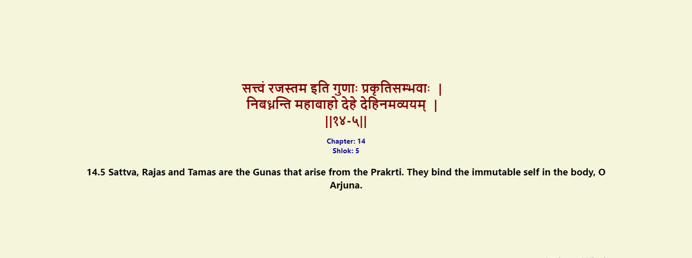

# Bhagavad Gita Chrome Extension

The Bhagavad Gita Chrome Extension is a custom extension for Google Chrome that displays a new verse (shloka) from the sacred scripture Srimad Bhagavad Gita every time a new tab is opened. It serves as a daily source of inspiration and spiritual guidance for users.

## Installation

To install the Bhagavad Gita Chrome Extension manually, follow these steps:

1. Download the extension files by clicking on the "Download ZIP" button on the [GitHub repository](https://github.com/praneel1/Bhagwad-Gita-Extension).
2. Extract the ZIP file to a folder on your computer.
3. Open Google Chrome and navigate to `chrome://extensions`.
4. Enable the "Developer mode" toggle located at the top right corner of the page.
5. Click on the "Load unpacked" button.
6. Select the folder where you extracted the extension files in Step 2.
7. The Bhagavad Gita Chrome Extension will be loaded and activated in your browser.

## Usage

Once the extension is installed and activated, every time you open a new tab in Google Chrome, a new verse from Srimad Bhagavad Gita will be displayed. The extension will provide you with a daily dose of spiritual wisdom and insight, helping you connect with the profound teachings of the Bhagavad Gita.

## Feedback and Contributions

If you encounter any issues or have suggestions for improving the Bhagavad Gita Chrome Extension, please feel free to [open an issue](https://github.com/praneel1/Bhagwad-Gita-Extension/issues) on the GitHub repository. Contributions are also welcome!

## License

This project is licensed under the [MIT License](LICENSE.txt).
 
---

We hope you find the Bhagavad Gita Chrome Extension to be a valuable tool for spiritual growth and inspiration. May the divine teachings of the Bhagavad Gita illuminate your path and bring peace to your life.
